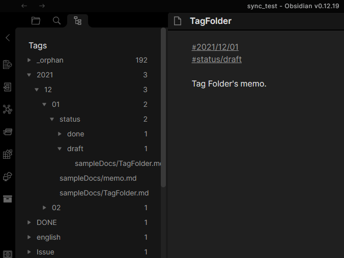
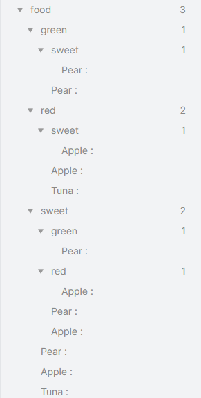
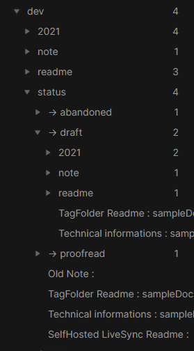
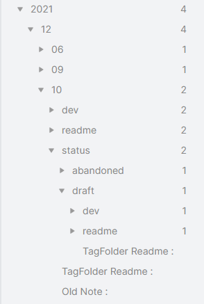

## TagFolder

This is the plugin that shows your tags as like a folder.



### How to use

Install this plugin, press `Ctrl+p`, and choose "Show Tag Folder".

### Behavior

This plugin creates a tree by tags permutation.

Like this,
### Simple case

If you have docs,
```
Apple : #food #red #sweet
Pear  : #food #green #sweet
Tuna  : #food #red
```


...and more are shown.

### Case of respecting nested tags

The nested tag works well for Tag Folder.

Tag Folder respects nested tags and makes the dedicated hierarchy. The nested child doesn't leak out over the parent.

```
TagFolder Readme: #dev #readme #2021/12/10 #status/draft
Technical informations: #dev #note #2021/12/09 #status/draft
SelfHosted LiveSync Readme : #dev #readme #2021/12/06 #status/proofread
Old Note: #dev #readme #2021/12/10 #status/abandoned
```
#### Tag hierarchy of status



#### Tag hierarchy of date




#### Search tags
You can search tags. As like this:

```
sweet -red | food -sweet
```
When using this filter, this plugin shows only "Pear" (Sweet but not red) and "Tuna" (food but not sweet).

### Settings

#### Always Open

Open Tag Folder when obsidian launched automatically.

#### Display Method

You can configure how the entry shows.

#### Use title

When you enable this option, the value in the frontmatter or first level one heading will be shown instead of `NAME`.

#### Frontmatter path
Dotted path to retrive title from frontmatter.

#### Use pinning
We can pin the tag if we enable this option.  
When this feature is enabled, the pin information is saved in the file set in the next configuration.  
Pinned tags are sorted according to `key` in the frontmatter of `taginfo.md`.

### Pin information file.
We can change the name of the file in which pin information is saved.

#### Order method (Tags)

You can order tags by:
- Filename
- Count of items

#### Order method (Items)

You can order items by:
- Displaying name
- Filename
- Modified time
- Fullpath of the file

#### Do not treat nested tags as dedicated levels

If you enable this option, every nested tag is split into normal tags.

`#dev/TagFolder` will be treated as like `#dev` and `#TagFolder`.

#### Reduce duplicated parents in nested tags

If we have the doc (e.g., `example note`) with nested tags which have same parents, as like `#topic/calculus`, `#topic/electromagnetics`:

- Disabled
```
topic
     - > calculus
         topic
               - > electromagnetics
                   example note
         example note 
```
- Enabled
```
topic
     - > calculus
          - > electromagnetics
              example note
         example note 
```

#### Hide Items

Configure hiding items.
- Hide nothing
- Only intermediates of nested tags
- All intermediates

If you have these items:
```
2021-11-01 : #daily/2021/11 #status/summarized
2021-11-02 : #daily/2021/11 #status/summarized
2021-11-03 : #daily/2021/11 #status/jot
2021-12-01 : #daily/2021/12 #status/jot
```

This setting affects as like below.
##### Hide nothing
```
daily
    → 2021
        → 11
            status
                → jot
                    2021-11-03
                → summarized
                    2021-11-01
                    2021-11-02
                2021-11-01
                2021-11-02
                2021-11-03
            2021-11-01
            2021-11-02
            2021-11-03
        2021-11-01
        2021-11-02
        2021-11-03
        2021-12-01
        → 12
            :
    2021-11-01
    2021-11-02
    2021-11-03
    2021-12-01
```

##### Only intermediates of nested tags
Hide only intermediates of nested tags, so show items only on the last or break of the nested tags.
```
daily
    → 2021
        → 11
            status
                → jot
                    2021-11-03
                → summarized
                    2021-11-01
                    2021-11-02
            2021-11-01
            2021-11-02
            2021-11-03
        → 12
            :
```
##### All intermediates
Hide all intermediates, so show items only deepest.
```
daily
    → 2021
        → 11
            status
                → jot
                    2021-11-03
                → summarized
                    2021-11-01
                    2021-11-02
        → 12
            :
```

#### Ignore note Tag

If the note has the tag that is set in here, the note would be treated as there was not.

#### Ignore Tag

Tags that were set here would be treated as there were not.

#### Ignore Folders

Ignore documents in specific folders.
