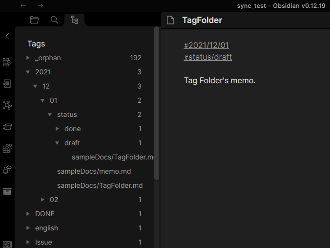
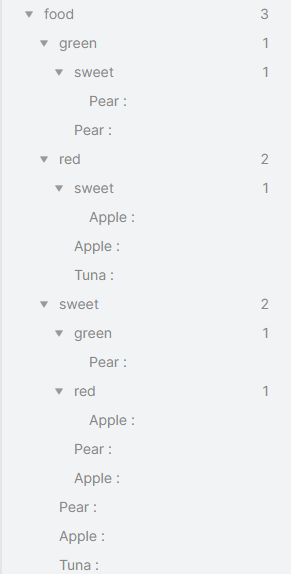
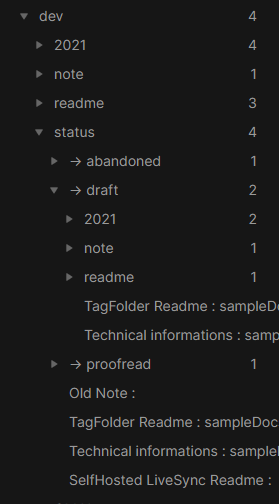
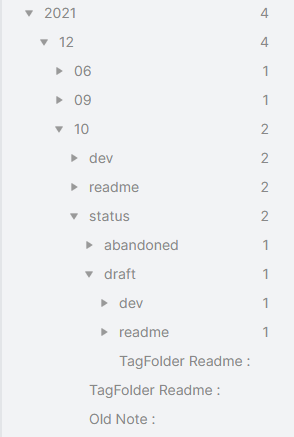

## TagFolder

This is the plugin that shows your tags like folders.



### How to use

Install this plugin, press `Ctrl+p`, and choose "Show Tag Folder".

### Behavior

This plugin creates a tree by tags permutation.

Like this,
### Simple case

If you have docs,
```
Apple : #food #red #sweet
Pear  : #food #green #sweet
Tuna  : #food #red
```


...and more are shown.

### Case of respecting nested tags

The nested tag works well for Tag Folder.

Tag Folder respects nested tags and makes the dedicated hierarchy. The nested child doesn't leak out over the parent.

```
TagFolder Readme: #dev #readme #2021/12/10 #status/draft
Technical information: #dev #note #2021/12/09 #status/draft
SelfHosted LiveSync Readme : #dev #readme #2021/12/06 #status/proofread
Old Note: #dev #readme #2021/12/10 #status/abandoned
```
#### Tag hierarchy of status



#### Tag hierarchy of date




#### Search tags
You can search tags. like this:

```
sweet -red | food -sweet
```
When using this filter, this plugin shows only "Pear" (Sweet but not red) and "Tuna" (food but not sweet).

### Settings

The settings are organized by the job you are trying to do:

- **Startup**: launch behavior.
- **Quick setup**: apply a common layout first, then fine-tune individual settings.
- **Simplify tree paths**: cleanup for repeated parents, redundant combinations, and intermediate levels.
- **Tag nesting and file rows**: controls for nested tags, duplicate files, and untagged or unlinked notes.
- **File display**: how files are named and sorted inside each folder.
- **Tag folder display**: tag sorting and virtual tags.
- **Pinned tags and aliases**: pinned tag order, custom tag marks, aliases, and redirects.
- **New notes and templates**: how TagFolder creates notes from the tag tree.
- **Filters**: which folders, notes, and tags are included.
- **Actions and panes**: click behavior and where file lists open.
- **Link folder**: incoming and outgoing link-tree behavior.
- **Advanced**: performance, drag behavior, and bug-report helpers.

#### Which setting do I want?

| Goal | Setting |
| ---- | ------- |
| Parent folders show the same note repeatedly | Tag nesting and file rows -> Duplicate file visibility -> Hide all parent duplicates |
| Show every note in every matching parent and sub-folder | Tag nesting and file rows -> Duplicate file visibility -> Show parent and child |
| Make `#a/b` behave like `#a` plus `#b` | Tag nesting and file rows -> Split nested tags |
| Let separate tags like `#a #b` appear as `#a -> #b` | Tag nesting and file rows -> Nest separate tags |
| Use a template when creating notes from TagFolder | New notes and templates -> Template |
| Browse notes by links instead of tags | Press `Ctrl+P` and run **Show Link Folder** |

#### Startup

##### Open TagFolder on startup

Place TagFolder on the left pane and activate it at every Obsidian launch.

#### Quick setup

##### Choose a starting layout

Use these presets when you are not sure which detailed settings you need.

- **Clean nested tree**: keeps nested tags as folders and shows each file only in the deepest sub-folder. Use this if parent tags show the same note repeatedly.
- **Show every match**: shows files at every matching tag level. Use this if you want parent folders to list everything under them.
- **Split nested tags**: treats a nested tag like `#a/b` as two separate tags: `#a` and `#b`.

#### Simplify tree paths

##### Merge redundant combinations
Merge equivalent tag combinations, such as `#a/b` and `#b/a`, when there is no intermediate folder to show.

##### Keep intermediate levels
Keep single-note paths expanded instead of collapsing them. Example: keep `#a -> #b` instead of showing `#a/#b` as one row.

##### Advanced: merge repeated parents

Use this when one note has multiple related nested tags, such as `#a/b` and `#a/c`.

When enabled, TagFolder avoids showing `#a` again inside the existing `#a` branch.

#### Tag nesting and file rows

##### Duplicate file visibility

Control whether files already shown in sub-folders also appear in their parent folders.

- **Show parent and child**: `#a/b` appears under both `#a` and `#a/b`.
- **Hide nested-tag parents**: `#a/b` appears only under `#a/b`, but `#a + #b` can still appear under both `#a` and `#a -> #b`.
- **Hide all parent duplicates**: hide parent rows whenever the same file appears in a child folder.

The middle option only matters when intermediate levels can be collapsed. If **Keep intermediate levels** is enabled, it is hidden because it has no meaningful effect.

##### Nest separate tags

When enabled, separate tags on the same note can form nested paths. For example, a note tagged `#a` and `#b` can appear under `#a -> #b`, even though those are two separate tags.

Turn this off to stop those separate-tag nesting paths and show each matching tag group more directly.

This does **not** split nested tags. A tag written as `#a/b` still behaves like a nested tag. Use **Split nested tags** if you want `#a/b` to behave like `#a` plus `#b`.

##### Split nested tags

If you enable this option, every nested tag is split into normal tags.

`#a/b` will be treated like `#a` and `#b`.

##### Group untagged/unlinked notes

Show untagged notes inside the special untagged folder, and unlinked notes inside the special unlinked folder, instead of as direct root-level file rows.

#### File display

##### Label

Choose whether file rows show the name, path, or both.

##### Sort order

You can order items by:
- Label
- Filename
- Modified time
- Created time
- Full file path

##### Sort exact folder matches first

When enabled, files that belong directly to the current folder are sorted before files that also appear in sub-folders. This prioritizes parent-folder matches but still keeps duplicate sub-folder matches visible.

##### Prefer Properties title

When enabled, the configured Properties value is shown when available. If it is missing, TagFolder falls back to the first H1 heading, then the file name.

##### Properties title path
Dotted path to retrieve the title from Properties. This setting is only enabled when **Prefer Properties title** is enabled.

#### Tag folder display

##### Sort order

You can order tags by:
- Tag name
- Number of files

##### Virtual freshness tags

When we enable this feature, our notes will be tagged as their freshness automatically.
| Icon | Edited ...            |
| ---- | --------------------- |
| 🕐    | Within an hour        |
| 📖    | Within 6 hours        |
| 📗    | Within 3 days         |
| 📚    | Within 7 days         |
| 🗄    | Older than 7 days ago |

##### Vault folders as tags

When we enable this feature, the folder will be shown as a tag.

#### Pinned tags and aliases

##### Enable tag metadata

Pinning lets you keep important tags near the top of the tag tree. When this setting is enabled, TagFolder reads tag metadata from the configured pin information file. Any tag entry with a `key` value is pinned and sorted before unpinned tags. The `key` is also the order key, so lower or alphabetically earlier keys appear first.

Pinning does not change the tags in your notes. It only changes how tags are displayed and sorted in TagFolder.

##### Metadata file

Markdown file used to store tag metadata. You can also create or update entries from the tag context menu.

| Item     | Meaning of the value                                                                              |
| -------- | ------------------------------------------------------------------------------------------------- |
| key      | If set, the tag is pinned. The value controls pinned-tag order.                                    |
| mark     | The label shown next to the tag instead of `📌`.                                                   |
| alt      | The tag will be shown as this. But they will not be merged into the same one. No `#` is required. |
| redirect | The tag will be redirected to the configured one and will be merged. No `#` is required.          |

#### New notes and templates

##### Store tags in Properties

This setting changes how tags are stored in new notes created by TagFolder when no template is used. When disabled, tags are stored as #hashtags at the top of new notes. When enabled, tags are stored in Properties.

##### Template

When this setting is set to a valid markdown template path, TagFolder uses that template immediately when creating a new note from the tag tree. The `.md` extension is optional. If the setting is empty, TagFolder creates a plain note using the setting above.

Templates can include these placeholders, which are replaced with the tags from the clicked location:

| Placeholder        | Replacement                         |
| ------------------ | ----------------------------------- |
| `{{expandedTags}}` or `{{tags}}` | Tags as hashtags, e.g. `#a #b` |
| `{{tagList}}`      | Tags as comma-separated text, e.g. `a, b` |
| `{{tagPath}}`      | Tags as a slash-separated path, e.g. `a/b` |
| `{{tagName}}`      | The last tag in the clicked context |
| `{{tagsJson}}`     | Tags as a JSON array                |
| `{{tagsYaml}}`     | Tags as YAML list lines             |

#### Filters

In this section, **vault folders** means real Obsidian folders that contain your notes, such as `Projects/ClientA`. **Tag folders** means the generated TagFolder tree created from tags, such as `#a -> #a/b`.

##### Vault folders - only include
Only index notes whose real vault path starts with one of these comma-separated folders. This does not filter generated tag folders.

##### Vault folders - exclude

Skip notes whose real vault path starts with one of these comma-separated folders. This does not hide generated tag folders.

##### Tag folders - exclude notes

Remove the whole note from TagFolder if it has any of these comma-separated tags. For example, if a note has `#a` and `#c`, and `#c` is excluded here, the note is not shown under `#a`, `#c`, or any other tag.

##### Tag folders - hide tags

Remove these comma-separated tags from the generated tree, but keep each note under its remaining tags. For example, if a note has `#a` and `#c`, and `#c` is hidden here, the note can still appear under `#a`.

##### Tag folders - archive tags
Show notes with these comma-separated tags under the matching generated tag folder instead of their other top-level tag folders. For example, if a note has `#a` and `#c`, and `#c` is archived here, the note is grouped under `#c` instead of `#a`.

#### Actions and panes

##### Tag clicks
We can search tags inside TagFolder when clicking tags instead of opening the default search pane.
With control and shift keys, we can remove the tag from the search condition or add an exclusion of it to that.

##### Separate file-list pane
When enabled, files will be shown in a separated pane.

##### Open file list in

Choose where newly opened file-list panes appear.

#### Link folder

##### Open

Link Folder is a separate pane from Tag Folder. Press `Ctrl+P` and run **Show Link Folder** to open it. You can also use the **Open** button in the Link folder settings section.

Tag Folder builds a tree from note tags. Link Folder builds a similar tree from note links:

- Incoming links are backlinks: notes that link to the current note.
- Outgoing links are notes that the current note links to.

##### Use incoming

Include backlinks: notes that link to the current note.

##### Use outgoing

Include outgoing links: notes that the current note links to.

##### Hide indirect notes

Show only first-degree linked notes. Hide notes that are reached only through another linked note.

##### Combine related branches

When link branches share notes, combine them into one connected tree instead of showing separate duplicate branches.

#### Advanced

##### Tag scanning delay

Delay in milliseconds before metadata changes are reflected in the tag tree. Plugin reload is required.

##### Disable tag dragging

Turn this off if drag-and-drop tag movement causes problems. This feature uses Obsidian internal APIs.

#### Utilities

##### Copy tags for bug reports

Copy the current tag data for a GitHub issue. Use disguised tags if the real tag names are private.
